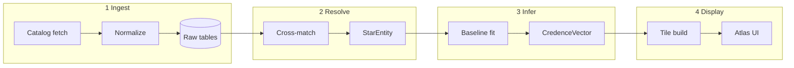

# Credence — design & architecture

This document describes the system design for **Credence**: ingest → resolve → infer → display for open-cluster stars. It is the canonical reference for data shapes, boundaries, and rollout tiers.

**Related:** [`CREDENCE.md`](CREDENCE.md) (usage & M34 benchmark) · [`/credence`](https://midasastronomy.com/credence) (product outline)

---

## 1. Purpose

### Goals

- **Unify** multi-survey star data into one resolved record per object.
- **Infer** cluster-conditioned credences (binary likelihood, channel scores, uncertainty) — not a catalog union.
- **Display** results in a planetarium-style atlas (pan/zoom celestial sphere, filterable layers).
- **Scale** from M34 (guided tour) to ~10⁶ known OC member stars (T2).

### Non-goals (v1)

- All-sky cluster **discovery** (UPMASK, HDBSCAN) — membership is **ingested**, not recomputed.
- Rendering all ~10⁹ Gaia sources — that is Gaia Sky / TAP, not Credence.
- Legacy ground photometry at galaxy scale — Midas-depth BVR exists for ~10¹ clusters only.
- A separate sub-brand or detector name — the pipeline **is** Credence.

---

## 2. System context

```text
┌─────────────────────────────────────────────────────────────────────────┐
│                         External catalogs                                │
│  Cantat-Gaudin · Hunt & Reffert · Gaia DR3 · AllWISE · 2MASS · literature│
└───────────────────────────────────┬─────────────────────────────────────┘
                                    │ ingest
                                    ▼
┌─────────────────────────────────────────────────────────────────────────┐
│                      Credence store (DuckDB / Parquet)                     │
│  clusters · membership · stars · modalities · baselines · credences      │
└───────┬─────────────────┬─────────────────┬───────────────────────────┘
        │ resolve         │ infer             │ display
        ▼                 ▼                   ▼
   StarEntity         CredenceVector      Credence Atlas
   (sparse joins)     (per star/cluster)  (tiles / API → web)
```

### Trust boundaries

| Boundary | Inside Credence | Outside (upstream) |
|----------|-----------------|---------------------|
| Cluster exists | Registry row + hull | Hunt/CG discovery |
| P(member) | Ingested, used as credence dim 0 | UPMASK / HDBSCAN |
| Gaia source_id | Resolve anchor | Gaia archive |
| Binary ground truth | Validation only (Malofeeva, WOCS PRV, …) | Literature |

---

## 3. Pipeline architecture

Four steps with explicit inputs/outputs. Each step is idempotent and versioned.



### 3.1 Ingest

**Responsibility:** Load external data into normalized tables without science logic.

| Source | Table | Key fields |
|--------|-------|------------|
| Cantat-Gaudin / Hunt | `membership` | `star_id`, `cluster_id`, `p_member`, `catalog` |
| Hunt / CG cluster params | `clusters` | `age`, `dist`, `ebv`, `r_j`, `type` |
| Gaia bulk TAP | `gaia_sources` | `source_id`, astrometry, photometry |
| AllWISE / 2MASS | `wise`, `twomass` | position, magnitudes |
| Literature (Malofeeva, WOCS, …) | `literature_flags` | `source`, `payload` |
| Legacy Midas (optional) | `legacy_photometry` | `midas_id`, BVR, plate coords |

**M34 today:** `fetch_published_catalogs.py`, `fetch_gaia.py`, `fetch_ir_photometry.py` → raw/processed CSVs.

**Galaxy scale:** Bulk membership from VizieR; Gaia by `source_id` list (not per-cluster cones for every object).

### 3.2 Resolve

**Responsibility:** One **StarEntity** per physical star with sparse modality attachments and cluster links.

```text
StarEntity
├── identity: gaia_source_id (primary), legacy_id?, names?
├── astrometry: ra, dec, parallax, pmra, pmdec
├── cluster_links: [{ cluster_id, p_member, catalog }]
├── modalities: sparse map
│   ├── gaia: { G, BP, RP, RUWE, … }
│   ├── wise: { W1, W2, … } | null
│   ├── twomass: { J, H, K } | null
│   ├── legacy_bvr: { B, V, R, I } | null
│   └── literature: { malofeeva?, wocs?, … }
└── resolve_meta: match_separations, pipeline_version
```

**Matching rules (M34):** Astropy `SkyCoord` nearest neighbor; Gaia default 1.5″; 2MASS/WISE 2″. Document per-survey rules in resolve config.

**M34 today:** `cross_match.py` → `m34_join.csv`; `merge_ir_photometry.py` → `m34_join_ir.csv` (de facto StarEntity export).

**Target:** `resolve_cluster()` → Parquet/DuckDB `star_entities` with stable schema.

### 3.3 Infer

**Responsibility:** Given `(StarEntity, cluster_id)`, fit or load a **cluster baseline** and emit a **CredenceVector**.

```text
ClusterBaseline (per cluster, versioned)
├── train_mask: P(member) ≥ threshold, photometry cuts
├── optical_sequence: poly coeffs + MAD (BP−RP vs G)
├── ir_sequence: poly coeffs + MAD (W2−BP vs BP−RP)
└── meta: age, dist, ebv, n_train, fit_timestamp

CredenceVector (per star, per cluster context)
├── p_member: from ingest (not re-estimated v1)
├── p_binary: primary infer head (sigmoid)
├── p_cmd, p_ir, p_ruwe: channel heads
├── score_infer: optional legacy fused residual export
├── z_optical, z_ir: diagnostic residuals (optional)
└── infer_meta: model_version, planes_used ("dual" | "optical_only")
```

**Current algorithm** (`midas/credence/`, `credence-mlp-v1`):

1. Gaia encoder: *G*, BP−RP, RUWE + missingness masks.
2. WISE encoder: W2−BP + mask when AllWISE absent.
3. Trunk: cluster context + P(member) → multi-head outputs.
4. Primary score: `p_binary`; channel heads `p_cmd`, `p_ir`, `p_ruwe`.

Training: CG members (P ≥ 0.7), member train/val split on M34. Checkpoint: `credence_model.pt`.

**Validation:** Malofeeva IR on M34 CG members (F1 ≈ 0.96 tuned). Cross-cluster held-out evaluation is the next milestone (T0).

**M34 today:** `validate_credence.py` → `credence_summary.json`.

### 3.4 Display

**Responsibility:** Planetarium UI — observer fixed at Earth, celestial sphere pan/zoom, no free-flight.

```text
Credence Atlas
├── Renderer: Three.js sphere (or d3-celestial fallback)
├── Data: region tiles (HEALPix or RA/Dec bins) + LOD
├── Layers: P(member), p_binary, score, source provenance, cluster hulls
├── Overlays: constellations, Messier/NGC labels, bright stars
└── Planets: ephemeris at view time (not stored in DB)
```

**Tile schema (sketch):**

```text
tile_id, ra_min, ra_max, dec_min, dec_max, lod,
  stars: [{ id, ra, dec, mag, credence_blob }]
```

**M34 today:** Static JSON on `/data` and `/compare` (Phase II explorer). **Target:** `/atlas` reading API/tiles from Credence store.

---

## 4. Data architecture

### 4.1 Logical layers

| Layer | Rows (T2 order) | Role |
|-------|-----------------|------|
| L0 `clusters` | ~10³–10⁴ | Registry, parameters, hulls |
| L1 `membership` | ~10⁶ | Star–cluster–P(member) |
| L2 `stars` | ~10⁶ unique Gaia IDs | Identity + astrometry |
| L3 `modalities` | ~10⁶ × sparse | Survey payloads (JSON or typed cols) |
| L4 `baselines` | ~10³ × versions | Cluster sequence fits |
| L5 `credences` | ~10⁶ × cluster context | Infer outputs |
| L6 `tiles` | ~10⁴–10⁵ | Display-optimized chunks |

### 4.2 Storage strategy

| Environment | Technology | Contents |
|-------------|------------|----------|
| Research / CI | DuckDB + local Parquet | Full pipeline, ad hoc SQL |
| Release | Zenodo Parquet bundles | Citable snapshots by tier |
| Web atlas | R2/S3 + optional Worker API | Tiles, cluster metadata, hulls |

**Size estimates (no Gaia XP):** L0–L5 ≈ **1–5 GB** compressed for ~10⁶ members. With XP: **50–200+ GB** — explicit opt-in tier.

### 4.3 Schema sketch (DuckDB)

```sql
-- L0
CREATE TABLE clusters (
  cluster_id TEXT PRIMARY KEY,
  name TEXT,
  ra DOUBLE, dec DOUBLE,
  age_gyr DOUBLE, dist_pc DOUBLE, ebv DOUBLE,
  catalog TEXT, object_type TEXT  -- OC | MG | GC
);

-- L1
CREATE TABLE membership (
  gaia_source_id BIGINT,
  cluster_id TEXT,
  p_member DOUBLE,
  catalog TEXT,
  PRIMARY KEY (gaia_source_id, cluster_id, catalog)
);

-- L2
CREATE TABLE stars (
  gaia_source_id BIGINT PRIMARY KEY,
  ra DOUBLE, dec DOUBLE,
  parallax DOUBLE, pmra DOUBLE, pmdec DOUBLE,
  phot_g DOUBLE, bp_rp DOUBLE, ruwe DOUBLE
);

-- L3 (sparse — example wide table; may normalize per survey)
CREATE TABLE modalities (
  gaia_source_id BIGINT,
  source TEXT,  -- 'wise' | 'twomass' | 'midas' | ...
  payload JSON,
  PRIMARY KEY (gaia_source_id, source)
);

-- L5
CREATE TABLE credences (
  gaia_source_id BIGINT,
  cluster_id TEXT,
  model_version TEXT,
  p_member DOUBLE,
  score_infer DOUBLE,
  z_optical DOUBLE, z_ir DOUBLE,
  p_binary DOUBLE,
  planes TEXT,
  computed_at TIMESTAMP,
  PRIMARY KEY (gaia_source_id, cluster_id, model_version)
);
```

---

## 5. Software architecture

```text
project-midas/
├── research/
│   ├── midas/
│   │   ├── credence/        # infer (model: data, model, engine)
│   │   ├── membership.py    # P(member) helpers
│   │   ├── join_table.py    # resolve helpers (future)
│   │   └── paths.py
│   ├── scripts/
│   │   ├── cross_match.py           # resolve (M34)
│   │   ├── merge_ir_photometry.py   # ingest + resolve IR
│   │   ├── validate_credence.py     # infer CLI
│   │   ├── train_credence.py        # train checkpoint
│   │   ├── build_web_credence.py    # display JSON export
│   │   └── build_tiles.py           # (planned) atlas tiles
│   └── docs/
│       ├── CREDENCE.md
│       └── CREDENCE_ARCHITECTURE.md   # this file
└── web/
    ├── src/pages/CredencePage.tsx     # product + design summary
    └── src/pages/AtlasPage.tsx        # (planned) display
```

### Package boundary (future `cluster-credence`)

| Module | Pipeline step |
|--------|---------------|
| `credence.ingest` | Catalog loaders, VizieR/Gaia bulk |
| `credence.resolve` | StarEntity builder |
| `credence.infer` | Baseline + CredenceVector (`credence.py` today) |
| `credence.export` | DuckDB/Parquet + tile builder |

Midas-specific paths stay in `project-midas`; the package is cluster-agnostic.

---

## 6. Web architecture

```text
┌──────────────┐     ┌─────────────────┐     ┌──────────────────┐
│ Static site  │     │ Credence API    │     │ Object storage   │
│ Vite/React   │────▶│ (future)        │────▶│ Parquet / tiles  │
│ /credence    │     │ tiles + hulls   │     │ on R2            │
│ /atlas       │     └─────────────────┘     └──────────────────┘
│ /findings    │
└──────────────┘
     ▲
     │ build_web_credence.py, build_tiles.py (CI)
     │
┌────┴─────────┐
│ credence_    │
│ summary.json │  ← M34 v0 (static)
└──────────────┘
```

**v0:** Prerendered site; infer summary in `web/src/data/credenceSummary.json`.  
**v1:** `/atlas` loads M34 tile bundle from static assets.  
**v2:** API + region loading for T1 census.

---

## 7. Scale tiers

| Tier | Clusters | Members | Ingest | Display |
|------|----------|---------|--------|---------|
| **T0** | 5–10 benchmark | 10⁴–10⁵ | Manual + scripts | M34 + fly-to demos |
| **T1** | ~1.5k–2k (G≲18) | ~3×10⁵ | CG bulk | Region tiles |
| **T2** | ~3.5k Hunt HQ | ~10⁶ | Hunt + Gaia IDs | Production atlas |
| **T3** | ~7k + XP | 10⁶–10⁷ | + Gaia XP | Research release |

M34 = **T0 demo** with rare legacy BVR modality.

---

## 8. M34 mapping (as-built → target)

| Step | As-built (Project Midas) | Credence target |
|------|--------------------------|-----------------|
| Ingest | `fetch_*.py`, raw CSVs | `membership`, `gaia_sources`, `modalities` tables |
| Resolve | `m34_join_ir.csv` | `StarEntity` Parquet / DuckDB view |
| Infer | `midas/credence.py`, `credence_summary.json` | `credences` table + versioned baselines |
| Display | `DataExplorer`, `/data` | `/atlas` planetarium |

---

## 9. Extension points

| Extension | Hook |
|-----------|------|
| New survey | Add `modalities.source` + resolve matcher |
| New infer channel | Baseline head + `CredenceVector` field |
| NN encoders | Replace/augment poly baseline; same vector schema |
| New cluster catalog | Ingest membership only; no infer rewrite |
| Calibrated P(binary) | Platt/isotonic on score_infer per tier |

---

## 10. Operational concerns

- **Reproducibility:** Pin `model_version`, catalog versions (Gaia DR, Hunt table), thresholds in export metadata.
- **Attribution:** Gaia, ESA, WISE, CG, Hunt — on atlas and Zenodo.
- **Uncertainty:** UI shows P(member) threshold, missing modalities, and score vs calibrated P(binary) distinctly.
- **CI:** `validate_credence.py` on M34 join; snapshot F1 in `credence_summary.json`; web build fails if schema drift.

---

## 11. Roadmap vs architecture

| Milestone | Architecture deliverable |
|-----------|-------------------------|
| v0 (now) | Model infer on M34 (`credence-mlp-v1`); static web summary |
| v1 | DuckDB schema + M34 load; `/atlas` |
| v2 | T0 multi-cluster ingest + cluster-held-out retrain |
| v3 | T1 ingest + tile pipeline |
| v4 | T2 atlas; Zenodo release |
| v5 | Gaia XP encoder; spectroscopic fine-tune |

---

## 13. Machine learning (infer engine)

**M34 ships a PyTorch MLP** (`midas/credence/`, `credence-mlp-v1`). The NN is not a separate product — it **is the infer step**, with the same ingest, resolve, and display contracts.

M34-only training overfits the benchmark (high val F1 on member split). The science milestone is **cluster-held-out evaluation** on T0 clusters before galaxy-scale rollout.

### 13.1 Implemented vs next

| Piece | M34 today (`credence-mlp-v1`) | Next |
|-------|-------------------------------|------|
| Cluster context | Hand features (dist, age priors) | Cluster encoder from member CMD cloud |
| Per-star score | Gaia + WISE encoders → multi-head | + legacy BVR encoder, XP (T3) |
| P(binary) | Sigmoid head + threshold tuning | Isotonic calibration on val |
| Missing WISE | Learned mask in WISE branch | Hold-out "WISE-missing" eval set |
| Cross-cluster | Single cluster (M34) | Train on T0, test on held-out cluster |

### 13.2 Prerequisites for T0 retrain

You cannot train a serious net until these exist:

**A. Resolved training tables (resolve + ingest at T0)**

- StarEntity rows for **multiple clusters** (not M34 alone — ~10⁵ stars minimum for a small MLP).
- Consistent feature schema: Gaia CMD, WISE pseudocolors, RUWE, optional legacy BVR.
- `p_member` as sample weight, not a hard filter only.

**B. Labels (the hard part)**

| Label type | Source | Use |
|------------|--------|-----|
| IR excess | Malofeeva-style | Noisy proxy; **partial circularity** if IR is an input |
| Photometric | Q, Excel | Legacy; cluster-specific |
| Astrometric | RUWE | Different physics (wide pairs) |
| Spectroscopic | WOCS PRV, SB9, eclipsing | **Gold** but sparse (M34: ~23 RV truth) |
| Eclipsing / SB9 | Catalog cross-match | Best for “binary” but incomplete |

There is **no galaxy-scale binary ground truth**. Training strategy must be:

1. **Multi-task** — predict channel flags + spectroscopic subset where available.
2. **Weak supervision** — Malofeeva/RUWE as soft targets with down-weighting.
3. **Hold-out clusters** — train on Pleiades + Hyades + M35, test on M34 (cluster CV, not random stars).

**C. Train / val / test protocol**

```text
Split by cluster (required)     — never leak same cluster across train and test
Split by modality completeness — hold out "WISE-missing" stars for generalization
Report per-channel + union     — not one F1 number
```

**D. Baseline to beat**

T0 models must beat **legacy Q-value** and **Malofeeva-only** on held-out clusters at matched precision.

### 13.3 Model architecture (implemented + sketch)

Modality-agnostic design — matches resolve’s sparse StarEntity:

```text
                    ┌─────────────────────┐
  cluster context   │ Cluster encoder     │  age, dist, E(B-V), member CMD histogram
  (from ingest)     │ (small MLP or set   │  or transformer over member subsample
                    │  transformer)       │
                    └──────────┬──────────┘
                               │ cluster embedding
     ┌─────────────────────────┼─────────────────────────┐
     │                         │                         │
┌────▼────┐              ┌─────▼─────┐             ┌─────▼─────┐
│ Gaia    │              │ WISE/IR   │             │ Legacy    │
│ encoder │              │ encoder   │             │ BVR enc.  │
│ (BP,RP, │              │ (W2−BP,   │             │ (optional)│
│  G,RUWE)│              │  JHK…)    │             │           │
└────┬────┘              └─────┬─────┘             └─────┬─────┘
     │                         │                         │
     └─────────────────────────┼─────────────────────────┘
                               ▼
                    ┌─────────────────────┐
                    │ Fusion trunk (MLP)  │  + missing-modality mask
                    └──────────┬──────────┘
                               ▼
              ┌────────────────────────────────┐
              │ Credence heads (multi-output)   │
              │ p_binary, p_cmd, p_ir, σ_uncert. │
              └────────────────────────────────┘
```

**M34 implementation:** `CredenceInferModel` in `midas/credence/model.py` — Gaia encoder (3+3), WISE encoder (1+1), trunk, four heads. ~10⁴ params.

**v2 scope:** Gaia XP coefficient encoder; set transformer over cluster members; MC dropout for uncertainty.

**Not in scope:** end-to-end membership discovery; replacing Hunt/CG with a net.

### 13.4 Training pipeline

Implemented:

| Component | Location |
|-----------|----------|
| Dataset + features | `midas/credence/data.py` |
| Model | `midas/credence/model.py` |
| Train/infer/validate | `midas/credence/engine.py` |
| CLI | `scripts/train_credence.py`, `validate_credence.py` |
| Web export | `scripts/build_web_credence.py` |

Still needed for T0:

| Component | Purpose |
|-----------|---------|
| DuckDB StarEntity at T0 | Multi-cluster training tables |
| `credence/train/labels.py` | Weak-label graph with provenance weights |
| Cluster CV harness | Train/test split by cluster |
| `calibrate.py` | Post-hoc isotonic on val → `p_binary` |
| CI | Smoke train; regression F1 on M34 subset |

**Loss (example):**

```text
L = w_bin · BCE(p_binary, y_soft)
  + w_cmd · MSE(z_opt, target_cmd)      # optional auxiliary
  + w_ir  · BCE(p_ir, y_malofeeva)      # down-weight circular IR
  + w_mem · sample_weight(p_member)
```

**Dependencies:** PyTorch (or JAX), scikit-learn for calibration, MLflow or W&B for runs — keep out of core `midas` until API stable.

### 13.5 Phased roadmap

| Phase | Data | Status |
|-------|------|--------|
| **ML-1** | M34 | Done — `credence-mlp-v1`, F1 ≈ 0.96 vs Malofeeva |
| **ML-2** | T0 (5–10 clusters) | Cluster-held-out retrain |
| **ML-3** | T1 (~3×10⁵) | + uncertainty head, magnitude-bin stability |
| **ML-4** | T2 + XP subset | XP encoder |
| **ML-5** | + SB9/eclipse labels | Spectroscopic fine-tune on gold set |

### 13.6 Relationship to Gaia-era ML literature

Existing work (Gaia XP supervised classifiers, MSMS catalogs) trains **field** or **all-Gaia** models without cluster context. Credence ML is differentiated by:

- **Cluster-conditioned** baselines (coeval population).
- **Sparse modalities** with explicit missingness.
- **Credence vector** output (multi-head, not single binary class).

Competing with full XP ML on raw accuracy is not the goal — **portability** (Gaia + WISE + membership) and **interpretable channel credences** are.

### 13.7 Next build order

1. DuckDB + StarEntity at T0 (ingest + resolve)  
2. Label join table with provenance and weights  
3. Cluster-held-out evaluation harness  
4. Retrain `credence-mlp-v2` on T0 with held-out cluster test  

Display (`/atlas`) ships on **model infer** — same `CredenceVector` columns, bump `model_version` on retrain.

---

## 12. Glossary

| Term | Meaning |
|------|---------|
| **Credence** | The full pipeline and product name |
| **StarEntity** | Resolved star with sparse modalities |
| **CredenceVector** | Infer output: scores + probabilities + metadata |
| **Cluster baseline** | Empirical single-star sequence for one cluster |
| **Credence Atlas** | Display layer — planetarium UI |
| **P(member)** | Ingested membership probability (credence dim 0) |
